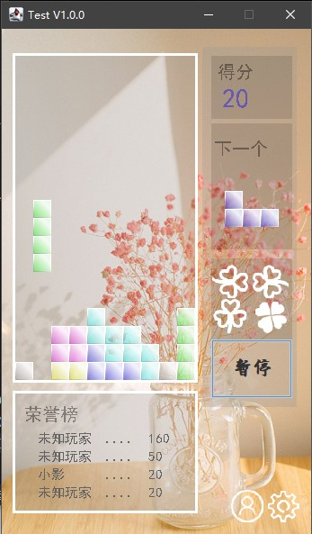

# java 俄罗斯方块

## 游戏效果图

## 游戏入口：
start.bat (windows下)

## 操作指南：
你可以使用按键（默认是上下左右）
|按键|实现操作|
| -- | -- | 
|上|旋转|
|下|向下运动|
|左|向左运动|
|右|向右运动|
你也可以使用鼠标点击操作区按键来控制方块

## 项目目录
|名称|实现内容|
| -- | -- | 
|model|游戏使用数据的存储|
|view|游戏界面的设计|
|controller|完成对数据的操作和不同层之间的联系|

